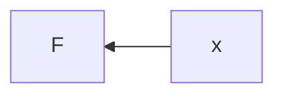
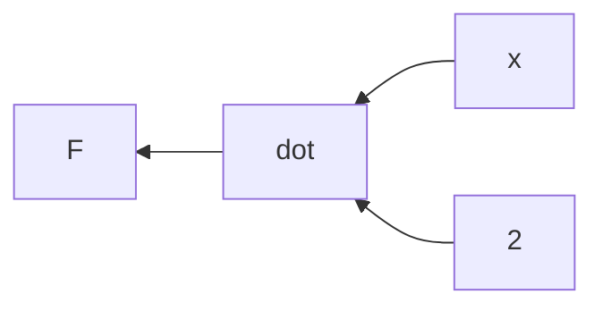
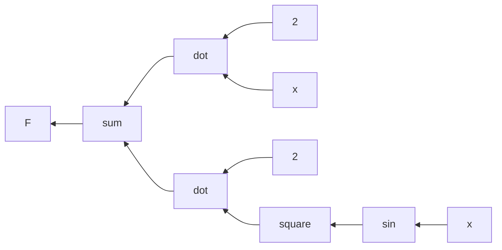
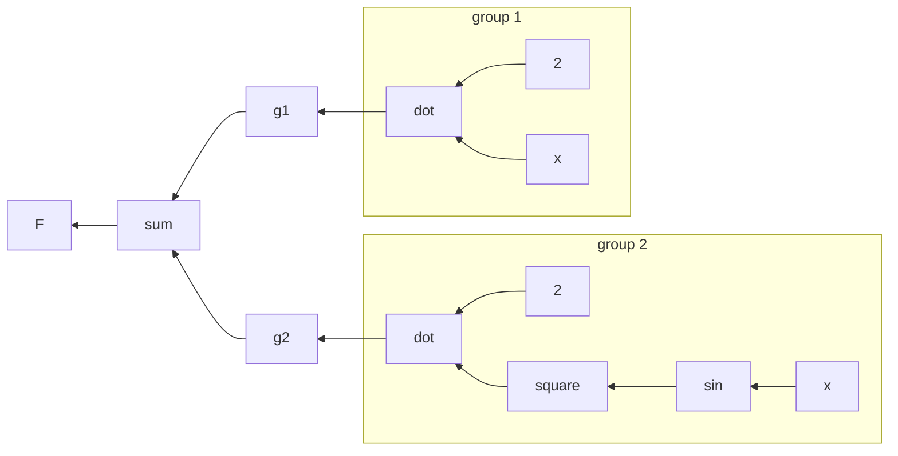
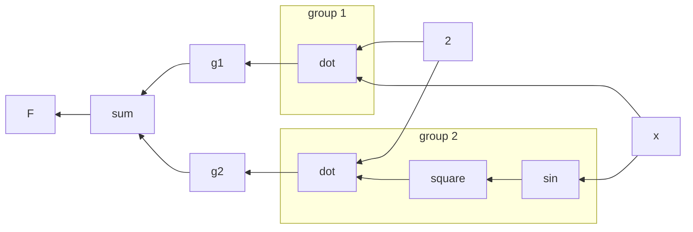

Learning is useless if we don't actually use what we learn. Let's review some math and see how we can compose functions.

Let's start with a simple function.

## Warming Up

$$
\mathbf{F}(x) = x
$$



This function is called an identity function. Next,

$$
\mathbf{F}(x) = 2\cdot x
$$

Can you guess the graph of the function? If not, read on.



Here, we compose the function by a dot product of two scalars, one static and the other variable.

## A More Complex Function
$$
\mathbf{F}(x) = 2\cdot x+2\cdot sin^2(x)
$$



Notice that we can separate the expression into groups:
$$
\mathbf{F}(x) =
\overbrace{2\cdot x}^{\text{group 1}}+
\overbrace{2\cdot sin^2(x)}^{\text{group 2}}
$$



Notice we have repeating nodes. Here we see the first point of optimization, and where we might use a graph over a tree. We can't just keep expanding expression forever, not very efficient.



## The Very Basic

### Monoid

These examples beg us define *actions* and *states*. A mathematical expression can be decomposed into *elementary actions* and *groups of operands* whereas each group if not elementary can be recursively decomposed again until it is atomic, ie a scalar (static or variable). These symbols in turn can be combined to produce *states*.

This is a good time to introduce algebraic structures as fundamental building blocks of computing.

Let's go back even further to the very basic. Let's say you have 1 marble. You found one and you put it together with your other marble.

We define a set $\{1, 2\}$ for the possible amounts of marble you might have so far. This set is extensible; you can put more marbles into your bag if you find more. Then, we define the operation $put$ to put a new marble together with ones you already have.

```haskell
data Marble = Marble Int

put :: Marble -> Marble
```

## Observations

Learning functional programming switches up the mental mode of a developer.
