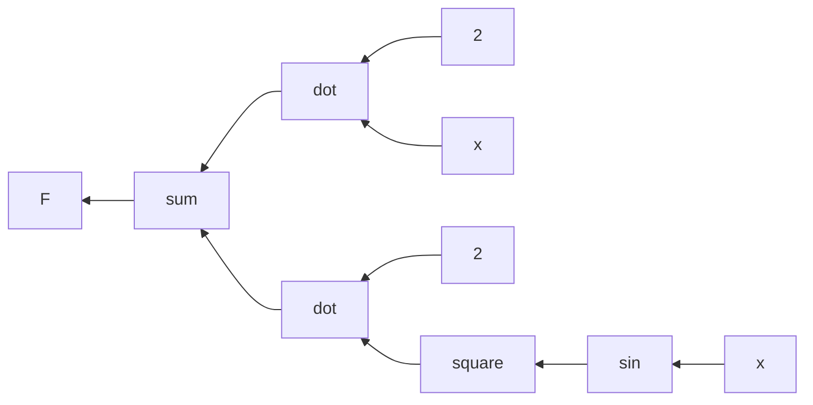
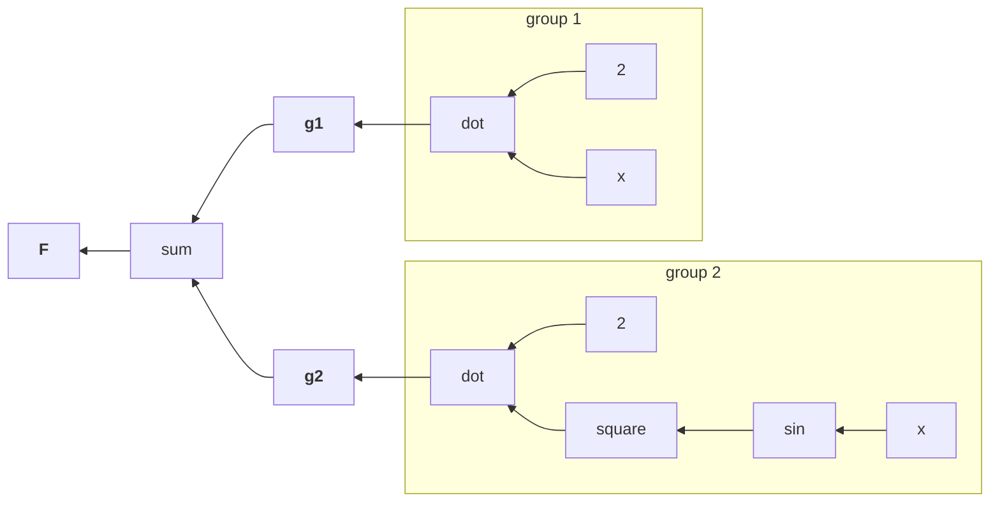

## Symbols

- It might be helpful to look at any variable as a [symbol](https://docs.github.com/en/repositories/working-with-files/using-files/navigating-code-on-github#using-the-symbols-pane) that might "hide" more meaning underneath.
- A function is a sort of symbol.
- The chain rule is a recursive function.

### A Simple Example

Let's start with a simple example. The [functional](https://en.wikipedia.org/wiki/Higher-order_function) below is composed of other functions, whose exact expressions we don't care about yet. We will only focus on the bird-eyed view now.
$$
\mathbf{F}=f(g(x))
$$

Then, the standard chain rule for the derivative of $\mathbf{F}$ with respect to $x$ is:
$$
\begin{align*}
\text{let}:\quad
	u &=g(x)\\
\text{then}:\quad
\mathbf{F}' &=f'(u)\cdot u'
\end{align*}
$$

Or, in another popular form:
$$
\begin{align*}
\text{let}:\quad\quad
	y &=f(g(x))\cr
	u &=g(x)\cr\cr
\text{then}:\quad
\frac{dy}{dx}&=\frac{dy}{du}\cdot\frac{du}{dx}
\end{align*}
$$

However, these forms are <u>incomplete</u>. This is because the **final derivative operation is often omitted for simplicity**.
$$
\begin{align*}
f'
	&=f'({\color{blue}u})
	\cdot {\color{blue}u'}({\color{red}x})
	\cdot\underbrace{\color{red}x'}_1\\\\
\text{or}:\quad
\frac{dy}{dx}
	&=\frac{dy}{d\color{blue}u}
	\cdot\frac{d\color{blue}u}{d\color{red}x}
	\cdot\underbrace{\frac{d\color{red}x}{d\color{red}x}}_1
\end{align*}
$$

By the chain rule for any variable $x$, the terminating operation is:
$$
x' \equiv dx \equiv \frac{\partial x}{\partial x}
$$

This final operation yields a value of $1$. However, it should be more accurately read as

> <u>a symbol</u> denoting a **unit** (or **identity**) element in the space of numbers. This element holds the value and label of "one".

Another example to land the point. In an $n\times n$ matrix, the $\mathbf{identity}$ matrix $I$ is a $\mathbf{unit}$ element.

Because we primarily operate in the space of real numbers, the unit "one" is often reduced and abstracted away for convenience. However, conveniences obfuscate, and sometimes the devil is in the details. Understanding the concept of a symbolic "unit" (which can be recursively or fractally defined) helps us understand how many algorithms work and implement them effectively.

### A More Concrete Example

$$
\mathbf{F}(x) = 2\cdot x+2\cdot sin^2(x)
$$

Notice that we can separate the expression into groups, each group is a symbolic unit representing a branch of the binary operator sum $(+)$.
$$
\mathbf{F}(x) =
\overbrace{2\cdot x}^{\text{group 1}}+
\overbrace{2\cdot sin^2(x)}^{\text{group 2}}
$$

We can continue this process. We can define new groups recursively for new operators/functions until we reach the base cases, which is either a *scalar* or a *variable*, the latter of which might be a recursive symbol itself.

## Summary

Understanding **symbolic representation** helps us partition and decompose a mathematical expression into elementary units. This process is crucial in implementing highly complex model functions in ML.

Furthermore, this process can also be applied to engineering more generally.

Before I started my computer science bachelor, I studied chemical engineering for a few years. One very important course I took was Principles of Chemical Processes (taught by [Prof. Su Ha](https://voiland.wsu.edu/vsceb-personnel-faculty/su-ha/), who was an amazingly passionate professor -- our ChemE cohort started very strong that year thanks to him). In retrospect, this is one of those first-principle corner-stones that I keep going back to for reference. In this course, we learned to map out manufacturing pipelines which may be composed from many processes including chemical reactions, filtrations and other operations. The output of one operation might be piped as the input of another, or it could be routed and recycled because the vast majority of operations are never 100% effecient.

One technique we learned from this course is to "box" some parts inside the larger diagram, and just focus on solving that box. This helped tremendously in reducing a complex problem into solvable parts.

The "box" can be thought of as a symbolic **unit** <u>relative</u> to the larger process.

I imagine that other engineering disciplines should have very similar techniques. I think the Agile method might actually be one application of this technique.

