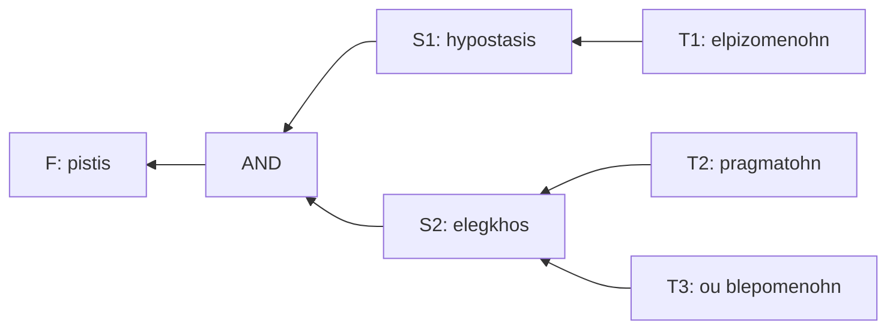

Let's try to parse and translate a verse from the Letter of St. Paul to the Hebrews. We will do just [one verse, Hebrews 11:1](https://biblehub.com/interlinear/hebrews/11-1.htm).

### Premise

$$
\begin{align*}
\underbrace{
\acute{E}\sigma\tau\iota\nu
\quad \delta\grave{\epsilon}
\quad %% pistis
    \pi\acute{\iota}\sigma\tau\iota\varsigma}_{\text{Now, faith is}}\\

%% elpizomenohn
&\underbrace{\acute{\epsilon}\lambda\pi\iota\zeta{o}\mu\acute{\epsilon}\nu\omega\nu}_{T_1}
    \quad %% hypostasis
    \underbrace{\acute{\upsilon}\pi\acute{o}\sigma\tau\alpha\sigma\iota\varsigma}_{S_1} ,\\
%% pragmaton
&\underbrace{\pi\rho\alpha\gamma\mu\acute{\alpha}\tau\omega\nu}_{T_2}
    \quad %% elenchos
    \underbrace{\acute{\epsilon}\lambda\epsilon\gamma\chi{o}\varsigma}_{S_2}
    \quad
    \underbrace{{o}\acute{\upsilon}}_{\text{not}}
    \quad
    \underbrace{\beta\lambda\epsilon\pi{o}\mu\acute{\epsilon}\nu\omega\nu}_{\text{being seen}}.
\end{align*}
$$

This statement can be rephrased as:
$$
\mathbf{F} = S_1(T_1) \quad\wedge\quad S_2(T_2, T_3)
$$

Where:

#### Table of [Symbols](https://docs.github.com/en/repositories/working-with-files/using-files/navigating-code-on-github#using-the-symbols-pane) and Their Meaning 

<table border style='border-collapse:collapse;'>
<tr>
    <th>greek</th>
    <th>preffix</th>
    <th>suffix</th>
    <th>meaning</th>
</tr>
<tr>
    <td>hypo-stasis</td>
    <td><em>hypo-</em>: under-, sub-</td>
    <td><em>stasis</em>: standing, stance</td>
    <td>under-standing, sub-stance</td>
</tr>
<tr>
    <td>elpizo-me-nohn</td>
    <td><em>elpizo</em>: to hope, to trust, to expect</td>
    <td><em>-me-nohn</em>: a passive-voice modifier</td>
    <td>[that which is] hoped for, what to trust in</td>
</tr>
<tr>
    <td>elegkhos</td>
    <td><em>eleg-</em>: a form of the verb [$\lambda\acute{\epsilon}\gamma\omega$](https://en.wiktionary.org/wiki/%CE%BB%CE%AD%CE%B3%CF%89) (lego: to talk, to say to, to converse)</td>
    <td><em>egkhos</em>: sound, voice (literally echos in English)</td>
    <td>
        <ul>
        <li>literal: talking out loud</li>
        <li>more likely: <a href='https://en.wikipedia.org/wiki/Socratic_method'>the Socratic method</a></li>
        <ul>
            <li>the scrutiny for the purpose of refutation</li>
        </ul>
        <li>correlated to: the process of falsifying a hypothesis</li>
        </ul>
    </td>
</tr>
<tr>
    <td>pragma-tohn</td>
    <td><em>pragma</em>: a deed, act, matter, affair, practice</td>
    <td><em>-tohn</em>: a plural modifier</td>
    <td>plural of pragma</td>
</tr>
<tr>
    <td>blepo-me-nohn</td>
    <td><em>blepo-</em>: to see, to discern, to notice</td>
    <td><em>-me-nohn</em>: a passive-voice modifier</td>
    <td>[that which is] seen, discerned, noticed</td>
</tr>
</table>

#### Therefore,

- $S_1$: under-standing (the ground to stand on), sub-stance, foundation
	- $T_1$: what to trust in, what to hope for, a positive or forward mindset
- $S_2$: [the Socratic method for analyzing and refuting an argument](https://en.wikipedia.org/wiki/Socratic_method), the process of falsifying a hypothesis, the scrutiny
	- $T_2$: deeds, acts, matters, affairs, practices
    - $T_3$: what not being seen, what in secret

#### Additionally,

We also do a forward and reverse scan over the surrounding text to get a sense of context. In the example below, I rearranged the phrases to flow better while preserving as much of the original Greek meaning:
<blockquote style='color:green;font-size:1em;padding:0 0.75em;margin-left:2em'>

... For in it [faith], the elders/patriarchs were commended. By faith, we understand that the ages have been made by the spoken words of God, so that which is not visible gives rise to the things that we can see...

</blockquote>

### Observations & Notes

In this verse, the parallel is drawn between the two symbols $S_1$ and $S_2$. The symbols $T_i$ are their modifiers. The word "faith" itself is part of a leading phrase. It is tempting at first to parallelize "faith" and "work" here, but that's not the right way to read this verse as shown in the graph above.

Because the original text was written in Koine Greek, it made sense to me that -- granting that historical context is far removed -- a translation should stay close to the meaning of the root components of the original Greek. This is the baseline to reduce uncertainty. Using this method, I was able to parse out a translation that I believe to be in spirit with the rest of the epistle.

The part I struggled the most is finding an appropriate meaning for the word $\acute{\epsilon}\lambda\epsilon\gamma\chi{o}\varsigma$ (elegkhos).

[All the English translations that I checked](https://biblehub.com/hebrews/11-1.htm) have used a single English word to point to some kind of "proof" or "evidence". This is a poor attempt at one-to-one mapping. This is because English historically is an *impure* Germanic language. English got intermixed with Latin, Greek and French multiple times throughout the ages. Therefore without proper context, the meaning of a word is completely arbitrary. This is also an example for the limit of a purely textual approach, i.e. *sola scriptura*, which I condemn as a stubborn attempt to "box" the words of the LORD.

Symbols are polymorphic by nature, which is caused by the fact that they are *induced* with information from many contexts. This often causes unintended ambiguity. However, if mapped out as clusters, the words and contexts should aggregate around some common centers. This is because language is first and foremost a map of reality -- its primary function, which often gets obfuscated by its self-referential property (Wittgenstein). Assuming this as foundation, we proceed with the next step of reasoning.

St. Paul was a highly educated (Hellenic) Roman citizen and a member of the Sanhedrin. On the other hand, *oration* -- or public speaking -- is the *de facto* form of thinking and public discourse among educated Hellenics. It is their inheritance from the Greek wisdom tradition, of which [the Socratic method](https://en.wiktionary.org/wiki/elenchus) is a core technique. Therefore, it is plausible to me that he should have been aware of this method and very likely presumed this meaning of the word.
$$
\acute{\epsilon}\lambda\epsilon\gamma\chi{o}\varsigma \equiv \text{the Socratic method}
$$

Finally, we must also remind ourselves of the content and audience of this letter: Judean Christians in Jerusalem, who were living under severe persecution at the time. Paul himself had been part of the ruling authority and one of the harshest persecutors, until his journey to Damascus. In this letter, he reminded his brothers and sisters in Christ of the continuation between the Old and New Sacrifices and ultimately to keep a steadfast obedience in the LORD despite the hard times.

### Translation

<blockquote style='color:green;font-size:1em;padding:0 0.75em;margin-left:2em'>

Now, faith is the foundation [through Scriptures] we trust in, and [faith is] the private scrutiny of our own actions.

</blockquote>

1. In short,
- faith is the to remember the LORD through Scriptures
- it is the private scrutiny of our own actions regardless of hard times

2. In long,
- faith is the understanding that:
    - what the prophets spoke of were worthy of being recorded into Scriptures,
    - all of which were fulfilled and pointed to the Son of Man in Jesus the Christ.
- faith calls for the proof of internal consistency through self-reflection.
    - we demonstrate our trust by ensuring that our actions are in accordance with the LORD's teaching (Matthew 6:3-8).
    - we forget something if we stop doing it with care; the ancients have forgotten the Covenent many times.

### Final Thoughts

Today, I am reading this verse in the context of my current professional situation. It's been very difficult this year for a lot of people in the field of IT, myself included. People got laid off in massive numbers, who then flooded the market and made it extremely hard for new grads to compete for even an entry level position. I myself sent out about 600 applications in the Summer of 2023, and I have seen someone automated 10,000 applications.

It is a very tough time for sure.

At a time like this, I know that it is very important to stay focused. If I don't receive what I want today, I should not be discouraged. It all boils down to "a skill issue", which means that my current skillset is not able to stand up to extreme scrutiny. However, because it is "a skill issue", it can be corrected.

Only the skills that have been scrutinized in secret today will become the ground on which I can stand in confidence tomorrow.

Let's continue to go at it relentlessly.

<em>the Holy Marina whacking the foolish head of a devil.</em>

